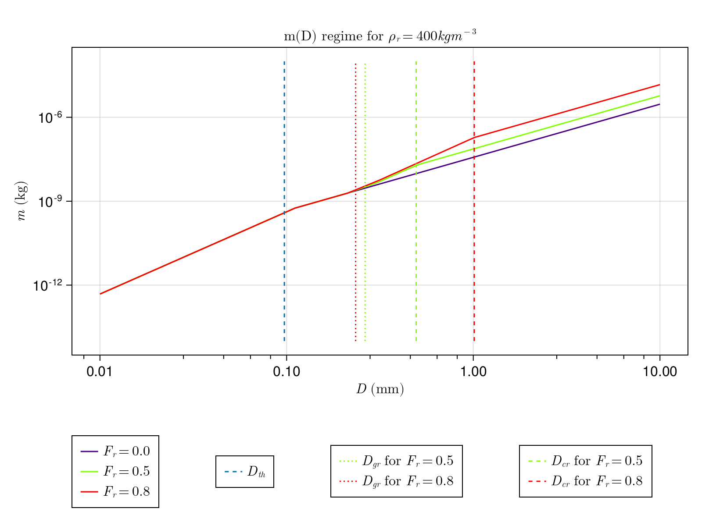
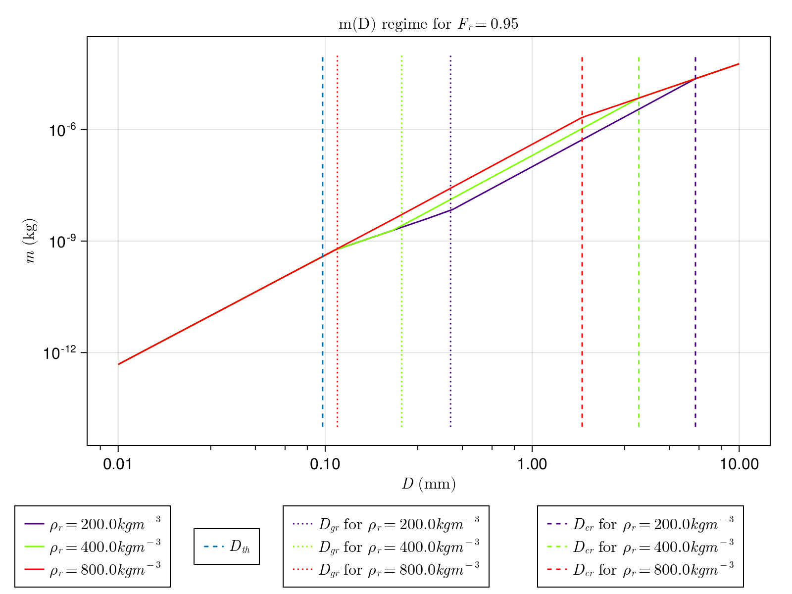

# P3 Scheme

The `P3Scheme.jl` module implements the predicted particle properties
 (P3) scheme for ice-phase microphysics developed by [MorrisonMilbrandt2015](@cite)

The P3 scheme is a 2-moment, bulk scheme involving a
 single ice-phase category with 4 degrees of freedom: total mass,
 rime mass, rime volume, and number mixing ratios.

Traditionally, cloud ice microphysics models use various predefined
 categories to represent ice modes, but the P3 scheme sidesteps the
 problem of prescribing transitions between ice categories by adopting
 a single ice category. This simplification might
 aid in attempts to constrain scheme parameters.

## Assumed particle size distribution (PSD)

Following [MorrisonMilbrandt2015](@cite), the scheme assumes a
 gamma distribution for the concentration of particles per unit volume:

```math
N'(D) = N_{0} D^\mu \, e^{-\lambda \, D}
```

where:
 - ``N'`` is the number concentration,
 - ``D`` is the maximum particle dimension,
 - ``N_0`` is the intercept parameter,
 - ``\mu`` is the shape parameter,
 - ``\lambda`` is the slope parameter.

and ``\mu \ = 0.00191 \lambda \ ^{0.8} - 2`` for ``\mu \ \in (0,6)``.

## Assumed particle mass relationships

The mass (m) of particles as a function of maximum particle dimension (D)
 is a piecewise function with variable breakpoints described
 by the following table.

| particle properties |      condition(s)     |    m(D) relation      |
|:--------------------|:----------------------|:----------------------|
|small, spherical ice | ``D < D_{th}`` | ``\frac{\pi}{6} \rho_i \ D^3`` |
|large, unrimed ice   | ``q_{rim} = 0`` and ``D > D_{th}`` | ``\alpha_{va} \ D^{\beta_{va}}`` |
|dense nonspherical ice | ``q_{rim} > 0`` and ``D_{th} < D < D_{gr}`` | ``\alpha_{va} \ D^{\beta_{va}}`` |
|partially rimed ice | ``q_{rim} > 0`` and ``D > D_{cr}`` | ``\frac{\alpha_{va}}{1-F_r} D^{\beta_{va}}`` |
|graupel (completely rimed, spherical)| ``q_{rim} > 0``and ``D_{gr} < D < D_{cr}`` | ``\frac{\pi}{6} \rho_g \ D^3`` |

where:
 - ``\rho_i \ = 917 kgm^{-3}`` (density of bulk ice)
 - ``D_{th} = (\frac{\pi \rho_i}{6\alpha_{va}})^{\frac{1}{\beta_{va} - 3}}``, the threshold between spherical and nonspherical unrimed ice;
 - ``q_{rim}`` is the rime mass mixing ratio for ice;
 - ``\alpha_{va} = 7.38 \times 10^{-11} \times 10^{6 \beta_{va} - 3}``, a parameter from [BrownFrancis1995](@cite), derived from measurements of mass grown by vapor diffusion and aggregation in midlatitude cirrus, and modified to agree with CliMA's units of ``kg`` and ``m`` rather than [BrownFrancis1995](@cite)'s ``g`` and ``\mu m``;
 - ``\beta_{va} = 1.9``, another parameter from [BrownFrancis1995](@cite);
 - ``D_{gr} = (\frac{6\alpha_{va}}{\pi \rho_g})^{\frac{1}{3 - \beta_{va}}}``, a threshold defined to ensure continuity and reasonable masses for smaller D;
 - ``D_{cr} = [ (\frac{1}{1-F_r}) \frac{6 \alpha_{va}}{\pi \rho_g} ]^{\frac{1}{3 - \beta_{va}}}``, the threshold separating partially rimed ice from graupel;
 - ``\rho_g = \rho_r F_r + (1 - F_r) \rho_d``, bulk density of graupel, calculated with the rime mass fraction weighted average of the predicted rime density and the density of the unrimed part, where the three determiners of ``\rho_g`` are defined:

| quantity |      symbol    |    definition      |
|:--------------------|:----------------------|:----------------------|
|rime mass fraction | ``F_{r}`` | ``\frac{q_{rim}}{q_{ice}}`` |
|predicted rime density   | ``\rho_{r}`` | ``\frac{q_{rim}}{B_{rim}}`` |
|density of unrimed ice | ``\rho_d`` | ``\frac{6\alpha_{va}(D_{cr}^{\beta{va} \ - 2} - D_{gr}^{\beta{va} \ - 2})}{\pi \ (\beta_{va} \ - 2)(D_{cr}-D_{gr})}`` |

Below are graphical representations of the m(D) regime, replicating
 Figures 1 (a) and (b) of [MorrisonMilbrandt2015](@cite):




## Assumed projected area relationships

The projected area (A) of particles as a function of maximum particle dimension (D)
 is another piecewise function with variable breakpoints described
 by the following table.

| particle properties |      condition(s)     |    A(D) relation      |
|:--------------------|:----------------------|:----------------------|
|small, spherical ice | ``D < D_{th}``        | ``\frac{\pi}{4} D^2`` |
|graupel (completely rimed, spherical)| ``q_{rim} > 0``and ``D_{gr} < D < D_{cr}`` | ``\frac{\pi}{4} D^2`` |
|large, unrimed ice   | ``q_{rim} = 0`` and ``D > D_{th}`` | ``\gamma \ D^{\sigma}`` |
|dense nonspherical ice | ``q_{rim} > 0`` and ``D_{th} < D < D_{gr}`` | ``\gamma \ D^{\sigma}`` |
|partially rimed ice | ``q_{rim} > 0`` and ``D > D_{cr}`` | ``F_{r} \frac{\pi}{4} D^2 + (1-F_{r})\gamma \ D^{\sigma}`` |

where all variables from the m(D) regime are as defined above, and:
 - ``\gamma = 0.2285`` and
 - ``\sigma = 1.88``, both from the aggregates of side planes, columns, bullets, and planar polycrystals in [Mitchell1996](@cite).

## Assumed particle fall speed relationships

Particle fall speed (V) as a function of maximum particle dimension,
 following [MorrisonMilbrandt2015](@cite), uses coefficients
 derived by [MitchellHeymsfield2005](@cite) and
 an air density modification provided by [cite: Heymsfield 2007] applied to
 particles having undergone sedimentation.

With the modification, particle fall speed is given:

```math
V(D) = (\frac{\rho_{air}}{\rho})^{0.54} a D^b
```

where:
 - ``D`` is the maximum particle dimension
 - ``\rho_{air}`` is a reference air density (see table below)
 - ``\rho`` is particle density

And without:

```math
V(D) = a D^b
```

where:
 - ``a = a_{1} \nu_{air}^{1 - 2 b_{1}} (\frac{2 \alpha_{va} g}{\rho_{air} \gamma})^b_{1}``
 - ``b = \frac{b_{1} (2 - \sigma) - 1}{1 - b_{1}}``

The parameters governing the coefficients a and b of the power law are from [MitchellHeymsfield2005](@cite) with exceptions as noted:
|    parameter     |              value                                                                |
|:-----------------|:----------------------------------------------------------------------------------|
|``a_{1}``         | ``\frac{C_{2} ([1 + C_{1} X^{0.5}]^{0.5} - 1)^{2} - a_{o} X^{b_{o}}}{X^{b_{1}}}`` |
|``b_{1}``         | ``\frac{C_{1} X^{0.5}}{2 ([1 + C_{1} X^{0.5}]^{0.5} - 1) (1 + C_{1} X^{0.5})^{0.5}} - \frac{a_{o} b{o} X^{b_{o}}}{C_{2} ([1 + C_{1} X^{0.5}]^{0.5} - 1)^{2}}`` |
|``\nu_{air}``, kinematic viscocity of air | See [CliMAParameters.jl](https://github.com/CliMA/CLIMAParameters.jl) |
|``\rho_{air}``, reference density of air | See [CliMAParameters.jl](https://github.com/CliMA/CLIMAParameters.jl) |
|``\mu_{air}``, dynamic viscocity of air | ``\nu_{air} \rho_{air}`` |
|``g``, gravitational acceleration | See [CliMAParameters.jl](https://github.com/CliMA/CLIMAParameters.jl) |
|``C_{1}``         | ``\frac{4}{\delta_{o}^{2} C_{o}^{0.5}}`` |
|``C_{2}``          | ``\frac{\delta_{o}^{2}}{4}`` |
|``\delta_{o}``, surface roughness constant for ice (applicable to graupel) | ``5.83`` |
|``C_{o}``, surface roughness constant for ice (applicable to graupel) | ``0.6`` |
|``a_{o}``, boundary layer depth (``\delta``) and effective area (``A_{e}``) dilation correction constant for aggregates | ``1.7e-3`` |
|``b_{o}``, boundary layer depth (``\delta``) and effective area (``A_{e}``) dilation correction constant for aggregates | ``0.8`` |
|``X``, Best/Davies number expressed in terms of m(D) and A(D) regimes | ``\frac{2 \alpha_{va} g \rho_{air} D^{\beta_va + 2 - \sigma}}{\gamma \nu_{air}^2}`` |
|``Re_{agg}``, Reynold's number used for aggregates | ``\frac{\delta_{o}^2}{4}((1 + \frac{4 X^0.5}{\delta_{o}^2 C_{o}^0.5})^0.5 - 1)^2 - a_{o} X^b_{o}`` |
|``Re_{grau}``, Reynold's numnber for graupel and hail (we drop the ``a_{o} X^b_{o}`` term here) | ``\frac{\delta_{o}^2}{4}((1 + \frac{4 X^0.5}{\delta_{o}^2 C_{o}^0.5})^0.5 - 1)^2`` |
|``A_{e}``, effective particle projected area accounting for increased boundary depth ``\delta`` | ``A(1 + \frac{\delta_o}{Re^0.5})`` |

## Predicted quantities and conserved, prognostic variables

## Microphysical process rates

## Simulations with the Kinematic1D.jl (KiD) model
