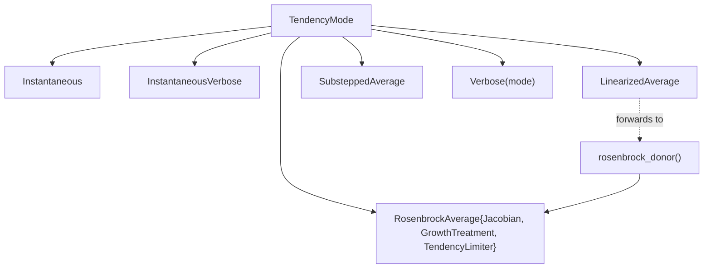

# Bulk-tendency averaging: modes and numerics

A bulk microphysics tendency is the rate of change of the condensate species (cloud liquid, cloud ice,
rain, snow, and the two-moment + P3 ice variables) produced by phase changes and particle interactions —
condensation and evaporation, deposition and sublimation, melting, collection, and the like. This page
covers how those tendencies are time-averaged over a dynamics step and the numerical behaviour of the
averaging modes. It takes the tendency itself as given; for the individual processes and the one-moment
donor-based linearization referenced below, read [Bulk Tendencies](@ref) first.

The bulk microphysics tendency is a stiff, nonlinear function of the local state. Over a dynamics step
``\Delta t`` the host model (ClimaAtmos) applies a single constant forcing, but a single explicit
evaluation of the pointwise tendency at the start-of-step state over- or under-shoots: the rates change
quickly within ``\Delta t``, because the depletion processes (evaporation, sublimation, melting) and the
vapor-exchange subsystem have time scales short compared with ``\Delta t``, so the start-of-step rate is
not representative of the step average. The averaging tendency modes address this by substepping the
pointwise tendency internally and returning the resulting ``\Delta t``-averaged rate

```math
\overline{T} = \frac{x(\Delta t) - x(0)}{\Delta t},
```

where `x` is the vector of prognostic species and `x(Δt)` is the state reached by the internal substep
integration. The host then sees a consistent constant forcing over `Δt`, computed from a sub-step-resolved
trajectory rather than a single endpoint slope.

This page explains the family of [`TendencyMode`](@ref CloudMicrophysics.BulkMicrophysicsTendencies.TendencyMode)
options, the substep semantics they share, the per-substep update equations (explicit forward Euler and the
linearized-implicit Rosenbrock–Euler update), the increment limiters, and the numerical behaviour that
motivates the [`rosenbrock_exact`](@ref CloudMicrophysics.BulkMicrophysicsTendencies.rosenbrock_exact)
configuration — the coarse-step deposition instability and the mixed-phase saturation criterion.

## The mode family

[`bulk_microphysics_tendencies`](@ref CloudMicrophysics.BulkMicrophysicsTendencies.bulk_microphysics_tendencies)
dispatches on a `TendencyMode` as its first argument. The modes form one family: an instantaneous evaluation
and several ways of averaging it.



- [`Instantaneous`](@ref CloudMicrophysics.BulkMicrophysicsTendencies.Instantaneous) returns the raw
  pointwise tendency from a single evaluation of all processes. There is no substepping and no `Δt`
  argument; it is the integrand the averaging modes substep.
- [`InstantaneousVerbose`](@ref CloudMicrophysics.BulkMicrophysicsTendencies.InstantaneousVerbose) returns
  the same aggregated tendencies plus every individual source term, for diagnostics.
- [`LinearizedAverage`](@ref CloudMicrophysics.BulkMicrophysicsTendencies.LinearizedAverage)`(; n_substeps)`
  takes `n_substeps` linearized-implicit (Rosenbrock–Euler) substeps with the donor-based Jacobian. The
  *donor* of a transfer is the species the mass (or number) leaves; the donor-based linearization
  approximates each rate as proportional to its donor specific content (see
  [Donor-based linearization](@ref)). This is the configuration ClimaAtmos uses operationally for the
  one-moment scheme. It forwards directly to
  [`rosenbrock_donor`](@ref CloudMicrophysics.BulkMicrophysicsTendencies.rosenbrock_donor), so it is the
  same code path as `RosenbrockAverage` with the donor Jacobian.
- [`RosenbrockAverage`](@ref CloudMicrophysics.BulkMicrophysicsTendencies.RosenbrockAverage)`(; jacobian, growth, limiter, n_substeps)`
  is the general linearized-implicit substepping mode. The Jacobian, the growth-diagonal treatment, and the
  increment limiter are selectable; see [Linearized-implicit options](@ref) below.
- [`SubsteppedAverage`](@ref CloudMicrophysics.BulkMicrophysicsTendencies.SubsteppedAverage)`(; n_substeps, limiter)`
  is the explicit forward-Euler counterpart: it advances the (limited) raw tendency by forward Euler over
  `n_substeps` substeps. It is available for both the one-moment and the two-moment + P3 models.
- [`Verbose`](@ref CloudMicrophysics.BulkMicrophysicsTendencies.Verbose)`(mode)` wraps an averaging mode and
  additionally returns the per-process tendencies realized by the implicit solve, attributed through the
  same substep factorization so that they sum to the net of the unlimited solve. It is a diagnostic path,
  separate from the model time step.

The averaging modes are implemented for the one-moment scheme over the four prognostic species
``x = (q_\mathrm{lcl}, q_\mathrm{icl}, q_\mathrm{rai}, q_\mathrm{sno})`` and for the two-moment + P3 scheme
over the eight prognostic species
``x = (q_\mathrm{lcl}, n_\mathrm{lcl}, q_\mathrm{rai}, n_\mathrm{rai}, q_\mathrm{ice}, n_\mathrm{ice}, q_\mathrm{rim}, b_\mathrm{rim})``.
Here ``q`` denotes a mass specific content and ``n`` the corresponding number specific content; the
subscripts are cloud liquid (``\mathrm{lcl}``), cloud ice (``\mathrm{icl}``, one-moment only), rain
(``\mathrm{rai}``), snow (``\mathrm{sno}``, one-moment only), and P3 ice (``\mathrm{ice}``), with
``q_\mathrm{rim}`` the rimed-mass and ``b_\mathrm{rim}`` the rimed-volume content of the P3 ice. The
one-moment cloud ice ``q_\mathrm{icl}`` and the P3 ice ``q_\mathrm{ice}`` are distinct species.

The host model selects the mode per microphysics scheme. ClimaAtmos runs `LinearizedAverage` for the
one-moment scheme and the explicit [`SubsteppedAverage`](@ref CloudMicrophysics.BulkMicrophysicsTendencies.SubsteppedAverage)
(with the saturation-adjustment limiter) by default for the two-moment + P3 scheme;
[`rosenbrock_exact`](@ref CloudMicrophysics.BulkMicrophysicsTendencies.rosenbrock_exact) is the
linearized-implicit alternative for the two-moment + P3 scheme, used when stability at coarse time steps
is the priority. Both use the same consistent saturation-adjustment limiter and converge under substep
refinement; the explicit `SubsteppedAverage` is cheaper per substep but, being forward Euler, needs more
substeps than `rosenbrock_exact` to clear the stiff mixed-phase regime (see
[Convergence under substep refinement](@ref)).

## Substep semantics common to all averaging modes

Every averaging mode runs the same outer loop: `n` substeps of length ``h = \Delta t / n``, integrating the
pointwise tendency and returning ``(x_\text{after} - x_\text{before}) / \Delta t``. Four invariants hold
across the loop, independent of which per-substep update is used.

- **Frozen distribution shape.** For the two-moment + P3 scheme the P3 ice particle-size distribution has a
  slope parameter ``\lambda``; its logarithm ``\log\lambda`` sets the distribution shape and is held fixed
  for the whole call. The averaging integrates the mass and number transfers at a fixed distribution shape;
  the host recomputes ``\log\lambda`` between dynamics steps.
- **Total-water conservation.** Vapor is diagnosed as the residual ``q_\mathrm{vap} = q_\mathrm{tot} - \sum
  q_\text{condensate}`` and ``q_\mathrm{tot}`` is held fixed across the substeps. The vapor ↔ condensate
  phase changes are mass-neutral, so the substep integration conserves total water by construction; only the
  condensate species are advanced.
- **Local latent-heat temperature.** A local temperature ``T_\text{sub}`` evolves each substep from the
  latent heating of the realized increment, so a saturation-based limiter and the rate evaluation see a
  temperature consistent with the condensate already exchanged within the step (see
  [Between-substep temperature update](@ref)). Air density ``\rho`` is held fixed.
- **Positivity.** Each substep clamps the updated species to nonnegative values; negative inputs are clamped
  to zero on entry. A non-finite state or Jacobian falls back to a forward-Euler substep of the raw
  tendency.

### Forward-Euler substep

The explicit update ([`SubsteppedAverage`](@ref CloudMicrophysics.BulkMicrophysicsTendencies.SubsteppedAverage))
advances the state by the (limited) raw tendency ``f`` and clamps:

```math
x_{k+1} = \max\!\big(x_k + h\, f(x_k),\, 0\big).
```

This is the explicit reference. It is accurate only when ``h`` is small relative to every active process
time scale; at coarse ``h`` it over-/under-shoots, which is the behaviour the limiters and the implicit
update are designed to bound.

### Linearized-implicit (Rosenbrock–Euler) substep

The implicit update ([`RosenbrockAverage`](@ref CloudMicrophysics.BulkMicrophysicsTendencies.RosenbrockAverage)
and [`LinearizedAverage`](@ref CloudMicrophysics.BulkMicrophysicsTendencies.LinearizedAverage)) takes one
linearized-implicit step per substep. It solves for the increment ``\Delta x`` from

```math
\left(\frac{I}{h} - P J P\right) \Delta x = f(x_k), \qquad x_{k+1} = \max\!\big(x_k + \Delta x,\, 0\big),
```

where ``J`` is a matrix approximating the tendency Jacobian ``\partial f / \partial x`` and
``P = \mathrm{Diag}(z)`` is a species projection (``z_i \in \{0, 1\}``) that selects which species are taken
implicitly. Where ``P`` projects a species out, its row of ``I/h - PJP`` reduces to the identity and the
solve returns exactly the forward-Euler increment ``h\, f`` for that species, while the retained species
stay implicit — an implicit/explicit splitting at species granularity. For the donor configurations ``P``
is the identity (all species implicit); it is used only to take a near-empty species explicitly.

This is the one-stage, ``\gamma = 1`` Rosenbrock–Euler update (linearly implicit backward Euler):
``\Delta x = h (I - h\, PJP)^{-1} f(x_k)``. It is first-order in ``h``. For the linear modes captured by
``J`` it is L-stable — a decay mode linearized as ``\dot q = -D q`` decays monotonically over the substep
for any ``h``, with the amplification factor ``(1 + hD)^{-1} \to 0`` as ``hD \to \infty`` — so the implicit
treatment damps the stiff decay and vapor-exchange modes and the step stays bounded where forward Euler
would overshoot. L-stability bounds only the linearized response; it does not bound the nonlinear
deposition overshoot discussed in [The coarse-step deposition instability](@ref).

The linear solve is performed in *equilibrated* variables: each row and column is rescaled so the entries
are of comparable magnitude before factorization, which keeps the system well-conditioned. The substep
build forms the diagonal scaling ``S = \mathrm{Diag}(|x| + h|f| + \epsilon)`` and solves
``S^{-1} (I/h - PJP) S`` for the increment, so the rows — which span roughly nine orders of magnitude
between number and mass species — become order-one conditioned. Because the solve is linear in the
right-hand side, the same factorization is reused to attribute the increment to individual processes in the
[`Verbose`](@ref CloudMicrophysics.BulkMicrophysicsTendencies.Verbose) path.

### Between-substep temperature update

The local temperature is advanced each substep from the latent heating of the realized condensate
increment, partitioning by phase: liquid and rain on the latent heat of vaporization ``L_v``, ice (and
snow, one-moment) on the latent heat of sublimation ``L_s``. The one-moment scheme uses constant latent
heats; the two-moment + P3 scheme re-evaluates ``L_v`` and ``L_s`` at the current substep temperature
(with a 150 K floor) each substep. For the one-moment scheme,

```math
\Delta T = \frac{L_v\,(\Delta q_\mathrm{lcl} + \Delta q_\mathrm{rai}) + L_s\,(\Delta q_\mathrm{icl} + \Delta q_\mathrm{sno})}{c_p},
```

and for the two-moment + P3 scheme the ice mass enters on ``L_s``:

```math
\Delta T = \frac{L_v\,(\Delta q_\mathrm{lcl} + \Delta q_\mathrm{rai}) + L_s\,\Delta q_\mathrm{ice}}{c_p},
```

with ``c_p`` the dry-air specific heat at constant pressure. This is consistent with a microphysics-only
update at fixed density and energy and avoids coupling to a full thermodynamic solve; the host applies the
energy change implied by the returned condensate tendencies. The temperature evolution lets the
saturation-adjustment limiter (below) see the saturation deficit corrected for the latent heating already
realized within the step.

## Linearized-implicit options

[`RosenbrockAverage`](@ref CloudMicrophysics.BulkMicrophysicsTendencies.RosenbrockAverage) is parameterized
by three independent option families. The substep driver dispatches on the option types at compile time, so
a configured mode resolves with no run-time branch.

- **[`Jacobian`](@ref CloudMicrophysics.BulkMicrophysicsTendencies.Jacobian)** — the matrix ``J`` used in
  the substep solve.
  - [`DonorJacobian`](@ref CloudMicrophysics.BulkMicrophysicsTendencies.DonorJacobian) — the donor-based
    linearization ``M``: each transfer is linearized in its donor species, vapor sources enter as a
    constant, and rates are floored by ``\max(q_\mathrm{min}, q_\text{donor})``. This is the matrix the
    operational [`LinearizedAverage`](@ref CloudMicrophysics.BulkMicrophysicsTendencies.LinearizedAverage)
    mode uses.
  - [`CoupledDonorJacobian`](@ref CloudMicrophysics.BulkMicrophysicsTendencies.CoupledDonorJacobian) — the
    donor-based matrix with the vapor-competition (Wegener–Bergeron–Findeisen) coupling added. The
    donor-based linearization keeps only donor-species slopes; restoring the dependence of each rate on the
    shared vapor specific content recovers the cross-species coupling and corrects the sign of the
    snow-from-cloud-liquid entry. The coupling is approximated by its vapor part, the derivative of the
    vapor-exchange rates with respect to ``q_\mathrm{tot}``; the direct condensate dependence of the rates
    (rain ventilation, the availability terms) is not recovered, for which use `ExactJacobian`.
  - [`ExactJacobian`](@ref CloudMicrophysics.BulkMicrophysicsTendencies.ExactJacobian) — the exact tendency
    derivative, formed with `ForwardDiff`.

- **[`GrowthTreatment`](@ref CloudMicrophysics.BulkMicrophysicsTendencies.GrowthTreatment)** — how the
  positive (growth) diagonal of ``J`` enters the implicit operator.
  - [`ImplicitGrowth`](@ref CloudMicrophysics.BulkMicrophysicsTendencies.ImplicitGrowth) — leave ``J``
    unchanged.
  - [`ExplicitGrowthDiagonal`](@ref CloudMicrophysics.BulkMicrophysicsTendencies.ExplicitGrowthDiagonal) —
    zero the positive diagonal entries of ``J``, so a growth mode is taken explicitly and only the decay
    diagonal remains in the implicit operator.

- **[`TendencyLimiter`](@ref CloudMicrophysics.BulkMicrophysicsTendencies.TendencyLimiter)** — a limiter
  applied to the realized substep increment.
  - [`NoLimiter`](@ref CloudMicrophysics.BulkMicrophysicsTendencies.NoLimiter).
  - [`EndStateSaturationAdjustment`](@ref CloudMicrophysics.BulkMicrophysicsTendencies.EndStateSaturationAdjustment) —
    scale the increment so the latent-heated end state does not cross saturation over its more-supersaturated
    phase, ``\max(S_\mathrm{ice}, S_\mathrm{liq})``, where the supersaturation
    ``S = p_v / p_v^\mathrm{sat} - 1`` is positive when supersaturated and negative when subsaturated (see
    [The saturation-adjustment limiter](@ref)).

Three preset configurations are supported:

| preset | Jacobian | growth | limiter |
|---|---|---|---|
| [`rosenbrock_donor`](@ref CloudMicrophysics.BulkMicrophysicsTendencies.rosenbrock_donor)`()` | `DonorJacobian` | `ImplicitGrowth` | `NoLimiter` |
| [`rosenbrock_coupled`](@ref CloudMicrophysics.BulkMicrophysicsTendencies.rosenbrock_coupled)`()` | `CoupledDonorJacobian` | `ImplicitGrowth` | `NoLimiter` |
| [`rosenbrock_exact`](@ref CloudMicrophysics.BulkMicrophysicsTendencies.rosenbrock_exact)`()` | `ExactJacobian` | `ExplicitGrowthDiagonal` | `EndStateSaturationAdjustment` |

`rosenbrock_donor()` reproduces `LinearizedAverage` (the operational donor-based scheme) within the unified
framework; in `Float64` the two agree to round-off. On the two-moment + P3 model only `ExactJacobian` is
available (there is no donor-based matrix there); a `RosenbrockAverage` configured with another Jacobian
raises an error, so use `rosenbrock_exact()`.

A new Jacobian, growth treatment, or limiter is added by subtyping the corresponding option type and
defining its trait methods (`_jacobian_provider` and `_species_mask`; `_apply_growth`; `_apply_limiter`);
the substep driver then dispatches on the new type with no further changes.

## The saturation-adjustment limiter

A cell has two saturation thresholds, over liquid and over ice, and the condensation and deposition
processes draw on a single shared vapor reservoir. The end-state saturation-adjustment limiter prevents a
single substep increment from overshooting that reservoir into a non-physical, strongly supersaturated or
subsaturated state. There is one implementation — a uniform-increment bisection on the more-supersaturated
phase ``\max(S_\mathrm{ice}, S_\mathrm{liq})`` — shared by every averaging mode: both `RosenbrockAverage`
(hence `rosenbrock_exact`) and `SubsteppedAverage`, in the one-moment and the two-moment + P3 schemes alike.
Because the correction it applies vanishes as the substep length ``h \to 0``, the modes that use it converge
under substep refinement (see [Convergence under substep refinement](@ref)).

### Increment scaling

The limiter scales the whole substep increment by a single shared scalar ``s \in [0, 1]``. It acts only on a
cell that begins at or above saturation over its more-supersaturated phase and whose full-increment
latent-heated end state would drop below it; such a cell would over-deposit or over-condense in one step. The
retained fraction is the largest ``s`` for which the scaled, latent-heated end state stays at or above
saturation over the more-supersaturated phase ``\max(S_\mathrm{ice}, S_\mathrm{liq})``, found by bisection to
the precision of the floating-point type. A cell that begins subsaturated (evaporating or sublimating) cannot
over-deposit, so its increment is returned unchanged, and the limiter is a no-op at fine substeps where the
full step does not cross saturation.

Because this form acts only on substeps whose full increment would cross saturation and returns the
increment unchanged otherwise, the correction it applies vanishes as ``h \to 0``: it is *consistent*, so
every mode that uses it converges to the unlimited pointwise trajectory under substep refinement (see
[Consistency of the increment limiter](@ref) and [Convergence under substep refinement](@ref)).

Scaling the increment by one shared scalar — rather than scaling processes independently — is what keeps the
limiter stable: independent scaling breaks the coupling between paired transfers and the shared vapor draw.

### Positivity

Positivity is enforced separately from the saturation adjustment, as a per-substep floor: every species is
clamped to nonnegative values after each substep update (``\max(x, 0)``), for the explicit and the
linearized-implicit modes and for both schemes. In the two-moment scheme this floors each paired mass and
number species independently; the floor keeps the mean particle mass well-defined because a number content
that reaches zero takes the mass to zero on the same substep. There is no separate coupled mass/number sink
limiter.

## The coarse-step deposition instability

At a cold, ice-supersaturated state the ice-deposition tendency has an *autocatalytic* growth mode — the
deposition rate increases with the depositing species' own content, so the growth feeds itself. In the
one-moment scheme this is the snow deposition rate increasing with snow content (the larger snow population
collects more vapor); the two-moment + P3 scheme has the analogous mode in its P3 ice deposition. Either
way it is a positive Jacobian diagonal of order ``10^{-1}\ \mathrm{s^{-1}}`` (time scale of tens of
seconds). With the exact Jacobian and `ImplicitGrowth`, the implicit operator ``I/h - J`` loses
positive-definiteness once the growth eigenvalue exceeds ``1/h``, i.e. once the substep is coarse relative
to the growth time scale. The single substep then overshoots the nonlinear saturation limit (which the
linear operator does not see): the ice species is over-deposited far past the available vapor, the latent
heating drives a spurious temperature excursion, and the state goes non-physical. With the exact Jacobian
this crash occurs at every coarse time step in the single-column convective test (the one-moment snow case;
the two-moment + P3 ice case behaves the same way).

### What resolves it

The exact preset removes the growth mode from the implicit operator and bounds the now-explicit growth by
the physical saturation limit:

- **`ExplicitGrowthDiagonal`** zeros the positive diagonal, so the implicit operator carries only
  non-positive modes and is well-conditioned at any substep size. The exact off-diagonal couplings (which
  the donor-based matrix drops) are retained, so accuracy at cold, supersaturated cells is better than the
  donor scheme.
- **`EndStateSaturationAdjustment`** scales the substep increment by the largest ``s \in [0, 1]`` for which
  the latent-heated end state stays at or above saturation over its more-supersaturated phase
  (``\max(S_\mathrm{ice}, S_\mathrm{liq})``; see [The mixed-phase saturation criterion](@ref)). It acts only
  on cells that begin at or above saturation (a subsaturated, evaporating or sublimating cell cannot
  over-deposit, so its increment is returned unchanged). It is a no-op at fine substeps and engages only
  when the full step would cross saturation. The bisection count is set from the float precision.

Both pieces are required: zeroing the growth diagonal alone leaves the explicit growth unbounded at the
coarsest single-substep steps, and the saturation adjustment supplies the missing nonlinear bound. Together
they make the exact scheme robust across the resolved time-step envelope.

!!! note "Use two or more substeps for accurate climate"
    At a single substep the explicit growth is bounded only by the saturation adjustment, which
    over-produces precipitation at coarse time steps. Two or more substeps recover accurate precipitation;
    the saturation adjustment is then rarely active.

## The mixed-phase saturation criterion

The saturation-adjustment limiter limits the increment on the **more-supersaturated phase**,
``\max(S_\mathrm{ice}, S_\mathrm{liq})``: it keeps the latent-heated end state at or above the saturation of
whichever phase carries the larger supersaturation. Equivalently the vapor floor is the *lower* of the two
saturation specific humidities, since the smaller ``q_\mathrm{sat}`` is the larger supersaturation.

The two saturation curves cross at the freezing point (panel (c) below). Below freezing
``q_\mathrm{sat}^\mathrm{ice} < q_\mathrm{sat}^\mathrm{liq}``, so ice carries the larger supersaturation and
the criterion binds on ice — reducing exactly to the ice-saturation limit that bounds the deposition
instability, so the cold behaviour is unchanged. Above freezing the curves swap and the criterion binds on
liquid; an ice-only limit there would stop vapor depletion early and leave the cell supersaturated over
liquid, suppressing warm cloud, which binding on the more-supersaturated phase avoids.

A single 0-D parcel that exchanges vapor with cloud liquid and cloud ice only (no collection or
precipitation) isolates the mixed-phase physics behind the two thresholds. Cloud liquid is kinetically fast
and cloud ice slow, so while liquid is present it pins the vapor near water saturation (panel (a),
``S_\mathrm{liq} \approx 0``); the parcel stays supersaturated over ice (``S_\mathrm{ice} > 0``) and ice
deposits, drawing mass from the evaporating liquid (panel (b)) — the Wegener–Bergeron–Findeisen transfer.
Only once the liquid is exhausted does the vapor relax to ice saturation (``S_\mathrm{ice} \to 0``). The
drawdown from water saturation to ice saturation is therefore inherently a multi-step process at the
resolved time step.

```@example
include("plots/SatAdjustmentWBF_plots.jl")
```


Binding on ``\max(S_\mathrm{ice}, S_\mathrm{liq})`` is a single shared scalar on the whole increment, which
is what keeps the limiter stable: scaling processes independently breaks the coupling between paired
transfers and the shared vapor draw. The criterion binds the correct phase wherever a single phase grows
from vapor — ice only (the cold deposition cells, where it reduces to the ice limit) or liquid only (warm
cells). When both phases are supersaturated below freezing, a vigorous mixed-phase updraft core, the
criterion binds on the ice floor (the more-supersaturated phase there) and so condenses the co-present,
still-growing liquid past its own saturation in a single step rather than transferring it gradually. A fully
per-phase floor — binding on the first growing phase to saturate and letting the slower phase relax over
subsequent steps — would represent the gradual transfer more faithfully and is a candidate refinement. The
distinction is inactive at fine substeps, where the limiter rarely engages, and does not affect the cold
instability resolution, which is set by the ice floor.

## Convergence under substep refinement

As `n_substeps` increases, the substep length ``h = \Delta t / n`` shrinks and an averaging mode refines
toward the trajectory of the pointwise tendency — *provided its increment limiter is consistent*, that is,
the correction the limiter applies vanishes as ``h \to 0``. A limiter that does not vanish under refinement
changes the converged solution and biases the mode away from the pointwise trajectory, however many
substeps are taken.

All averaging modes use the same consistent uniform-increment bisection limiter: it acts only on a substep
whose full increment would cross saturation and returns the increment unchanged otherwise, so its correction
vanishes as ``h \to 0``, paired with a per-substep positivity floor that also vanishes under refinement.
They therefore converge in every regime — warm-rain, cold/ice, and mixed-phase — for both the one-moment and
the two-moment + P3 schemes.

The modes differ in how many substeps they need. The
[`rosenbrock_exact`](@ref CloudMicrophysics.BulkMicrophysicsTendencies.rosenbrock_exact) linearized-implicit
substep damps the stiff decay and vapor-exchange modes, so it stays bounded and refines smoothly from coarse
``h`` — it is accurate at few substeps even in the stiff mixed-phase regime. The explicit
[`SubsteppedAverage`](@ref CloudMicrophysics.BulkMicrophysicsTendencies.SubsteppedAverage) is forward Euler,
with no implicit damping, so it needs ``h`` small relative to the fastest process time scale; in the stiff
mixed-phase regime it needs many more substeps than `rosenbrock_exact` to reach the same accuracy, but it
converges to the same saturation-adjusted trajectory. The figure below shows both modes converging in the
warm-rain regime, and in the mixed-phase regime `rosenbrock_exact` converging at few substeps while
`SubsteppedAverage` converges more slowly.

```@example
include("plots/AveragingConvergence.jl")
```


Relative end-state error against a finely substepped reference versus the number of substeps, at ``\Delta t
= 30\ \mathrm{s}``, for the two-moment + P3 scheme. Left: a warm-rain state, where both modes converge.
Right: a mixed-phase state near freezing, where both modes converge to the same trajectory but the
linearized-implicit `rosenbrock_exact` converges at far fewer substeps than the explicit `SubsteppedAverage`,
which is forward Euler and must resolve the stiff regime.

This is a real accuracy-versus-cost trade-off. `rosenbrock_exact` forms an exact Jacobian by `ForwardDiff`
and solves a linear system each substep, so a single microphysics tendency evaluation is roughly an order of
magnitude more expensive than the explicit `SubsteppedAverage`. In a host model this per-evaluation cost is
amortized against the dynamics, transport, and other physics of the step, so the increase in full-step wall
time is typically much smaller, and is negligible where microphysics is a small fraction of the step.
`SubsteppedAverage` is cheaper per substep but needs more of them in stiff regimes; `rosenbrock_exact` is
preferred when stability or accuracy at coarse substep counts matters (see
[Consistency of the increment limiter](@ref)).

## Approaches that did not resolve the instability

These were tried and are not part of the supported framework; they are recorded here because the failure
modes are instructive.

- **Field-of-values growth bound** (a uniform diagonal shift bringing the operator's rightmost eigenvalue to
  ``\alpha/h``). It stabilizes the linear operator but does not bound the single-step explicit overshoot of
  the nonlinear source as it approaches saturation: the crash is a saturation overshoot, not an operator
  amplification, so the shift only delays it. With ``\alpha`` near one the near-singular resolvent it leaves
  amplifies the deposition into a larger overshoot.
- **Diagonal growth bound** (bound each positive diagonal at ``\alpha/h``). A cheaper variant of the above
  with the same limitation, and bounding a positive diagonal balanced by off-diagonal structure can itself
  destabilize an otherwise-stable step.
- **Smooth species mask** (a differentiable replacement for the near-empty species mask). At coarse single
  substeps it routes activating ice and liquid species to a forward-Euler step, which itself overshoots the
  fast deposition.
- **Implicit temperature** (promoting ``T`` into the implicitly solved state). It removes the operator-split
  oscillation of the between-substep temperature update, but the dominant limit on the growth — the nonlinear
  vapor depletion — is not linear, so a linear implicit temperature feedback does not bound the deposition
  overshoot at fixed coarse substeps.
